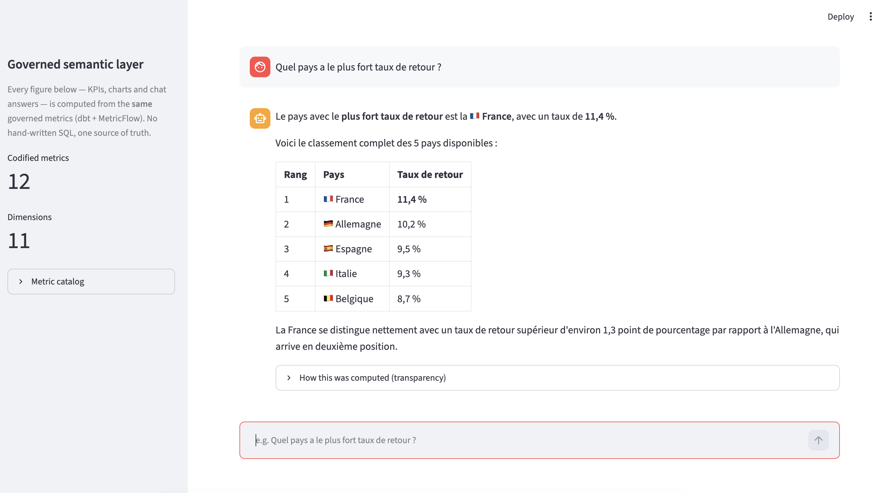
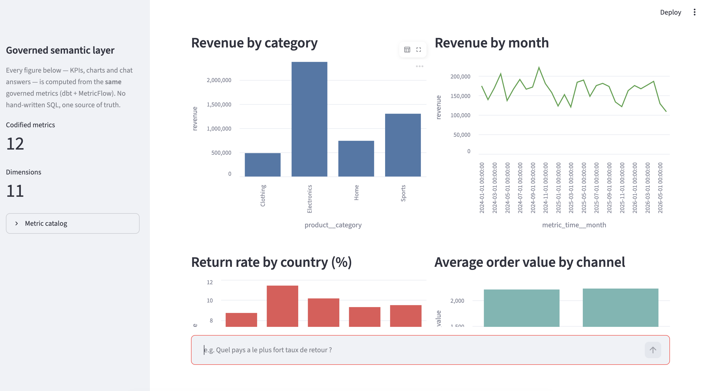
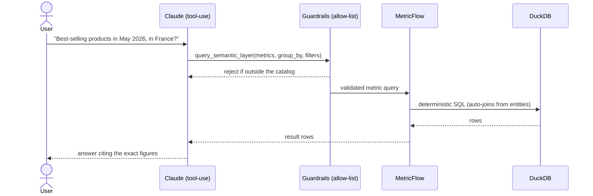

# Governed Analytics Agent

> Ask business questions in plain language and get **governed, deterministic**
> answers — an LLM agent that reasons over a **dbt + MetricFlow semantic layer**,
> never over raw SQL.

A portfolio project built around the hottest 2026 data-engineering trend: the
**semantic layer** as the single source of truth, and **governed agentic
analytics** on top of it. The numbers are computed once, in code, and reused by
both a BI dashboard and an AI agent — so a chart, a notebook and the chatbot can
never disagree.

**Stack:** Python · uv · DuckDB · dbt (Medallion / star schema) · MetricFlow
(dbt Semantic Layer) · Anthropic Claude (tool use) · Streamlit · Docker / Colima
· pytest.

---

## Why this project

Two converging 2026 trends:

1. **The semantic / metrics layer is the new center of gravity.** Codify each
   metric (revenue, gross margin, AOV, return rate…) *once*, in versioned YAML,
   and every consumer queries that definition. No more "which dashboard has the
   right revenue number?".
2. **Agentic analytics done safely.** Raw text-to-SQL hallucinates joins and
   "almost-right" figures. The winning pattern is an LLM that selects a
   **governed metric**, while the semantic layer compiles a **deterministic,
   correct SQL** query. The LLM does semantic routing; it never writes SQL.

This repo implements exactly that, end to end.

---

## Screenshots

**Governed conversational analytics** — the agent maps the question to metrics +
dimensions, runs deterministic SQL, and shows a transparency panel (metric used,
rows, and the exact SQL):



**BI dashboard** — KPIs and charts computed from the *same* governed metrics, no
hand-written SQL:



---

## Architecture


**The agent's request flow** — every step is validated before anything runs:



---

## The semantic layer, in one minute

MetricFlow turns the Gold star schema into a governed model:

- **Semantic model** — describes a table's *entities* (join keys), *dimensions*
  (ways to slice), and *measures* (raw aggregations like `sum(revenue)`).
- **Entities → automatic joins.** Because keys are declared, MetricFlow builds
  the join path itself. Nobody — not even the LLM — writes a `JOIN`, so a wrong
  join is impossible.
- **Metric** — the reusable business definition built on measures. Types used
  here: *simple* (wraps a measure), *ratio* (`gross_margin = profit / revenue`,
  `AOV = revenue / orders`), *derived* (`return_rate`), and *filtered* (e.g.
  `completed_revenue`).

The **12 governed metrics**: `revenue`, `cost`, `gross_profit`,
`quantity_sold`, `discount`, `orders`, `active_customers`, `completed_revenue`,
`returned_orders`, `gross_margin_rate`, `average_order_value`, `return_rate`.

---

## The governed agent (defence in depth)

The LLM is constrained by three layers, so it can only ever produce a valid,
read-only metric query:

1. **Constrained tool schema** — Claude calls a single `query_semantic_layer`
   tool whose JSON schema only *offers* the catalog's metrics (as an `enum`),
   dimensions and a set of structured **filters** (`{dimension, operator,
   value}` — never free-form SQL).
2. **Runtime validation (allow-list)** — every argument is re-checked against
   the catalog before execution: unknown metric/dimension → rejected, bad time
   value → rejected, disallowed operator → rejected. Filter values are
   quote-escaped, so an injection payload can't break out of the literal.
3. **Deterministic compilation** — MetricFlow turns the validated selection into
   correct SQL. The agent has **no path to raw SQL**.

If Claude picks something invalid, it receives a tool error and **self-corrects**
on the next turn. Structured **filters** mean "in May 2026", "for France" or
"completed orders only" are pushed down to the warehouse instead of
over-fetching and filtering in the model's head.

---

## Quickstart

Requires [uv](https://docs.astral.sh/uv/) and an Anthropic API key (for the chat).

```bash
git clone https://github.com/behramkorkut/governed-analytics-agent
cd governed-analytics-agent

make setup                 # uv sync (creates .venv from the lockfile)
cp .env.example .env       # then add your ANTHROPIC_API_KEY
make warehouse             # generate data -> dbt build -> semantic manifest

make run                   # Streamlit dashboard at http://localhost:8501
# or ask from the terminal:
make agent Q="Revenue and gross margin by product category"
make test                  # 20 tests
```

Run `make help` to see every target.

### One command with Docker (Colima-ready)

```bash
colima start               # provides the Docker engine on macOS
docker compose up --build  # http://localhost:8501
```

The container builds the warehouse on first boot and persists it in a named
volume. Secrets are injected at runtime via `.env`, never baked into the image.

---

## Project structure

```
governed-analytics-agent/
├── governed_analytics_agent/   # the agent package
│   ├── catalog.py              # allow-list, derived from the semantic manifest
│   ├── guardrails.py           # validation (metrics, dims, filters, bounds)
│   ├── semantic_layer.py       # MetricFlow client + safe filter compilation
│   ├── agent.py                # Claude tool-use loop
│   ├── reporting.py            # governed metrics -> DataFrames (for the BI)
│   └── cli.py
├── dbt/retail_dwh/             # dbt project
│   └── models/
│       ├── staging/            # Silver (cleaning / conforming)
│       └── marts/              # Gold (star schema) + semantic/ (MetricFlow)
├── scripts/                    # generate synthetic data, load Bronze
├── streamlit_app.py            # dashboard + governed chat
├── tests/                      # pytest (unit + integration)
├── docker/                     # Dockerfile + entrypoint
├── docker-compose.yml
└── Makefile
```

---

## Data model

The Gold layer is a Kimball **star schema**: a `fact_sales` table at order-line
grain (additive measures: revenue, cost, profit, quantity, discount) surrounded
by conformed dimensions `dim_customers`, `dim_products`, `dim_stores` and a
`dim_dates` spine (which also serves as the MetricFlow time spine). Data quality
is enforced by **41 dbt tests**, including referential integrity from every fact
row to its dimensions.

The source data is **synthetic and deterministic** (seeded), and deliberately
"dirty" at the Bronze layer (≈20 spellings of each country, dates as text, NULLs)
so the Silver layer has real cleaning/conforming work — the whole point of the
Medallion pattern.

---

## Testing

```bash
make test
```

- **Unit tests** (no warehouse): guardrails, filter compilation, injection
  escaping, tool-schema construction.
- **Integration tests**: real MetricFlow execution and the full agent loop with
  a mocked LLM client. They skip cleanly if the warehouse isn't built yet.

---

## The LLM narrative layer: safeguards & roadmap

The **figures are deterministic and authoritative** (that is the entire point of
the semantic layer). The remaining risk is the LLM's *commentary*. Current
safeguards:

- An **analytical-rigor system prompt**: separate facts from interpretation,
  don't over-claim correlation/causation from few points, flag partial periods,
  state filter assumptions, never compare against a period it didn't query.
- A **transparency panel** exposing the metric, the rows and the SQL behind every
  answer, so a decision-maker can audit it.

Planned improvements (not yet implemented), to harden the narrative:

- **Deterministic pre-computed insights** (shares of total, deltas, MoM/YoY,
  rankings) computed in code and handed to the LLM to phrase — removes "~X%"
  estimates.
- **Coverage metadata** (max date, period completeness, row counts) injected as
  context, so partial periods are flagged automatically.
- **A critic / verification pass** (LLM-as-judge or rules) that rejects any claim
  not backed by a query, plus an anti-fabrication check that every cited number
  appears in the returned rows.
- **UI separation** of "Figures" (deterministic) vs "Reading" (LLM); low decoding
  temperature; and an **evaluation harness** (NL question → expected metric
  selection) to measure routing accuracy and narrative rigor objectively.

---

## What this demonstrates

Analytics engineering (dbt, Medallion, star schema, data quality), the modern
**semantic / metrics layer** (MetricFlow), **safe agentic AI** (tool use,
allow-list governance, deterministic execution, injection-safe filters),
plus solid engineering practices: reproducible environments (uv), containerized
delivery (Docker/Colima), a self-documenting Makefile, and a tested codebase.

Built on the same star-schema lineage as my
[`modern-dwh-dbt-airflow`](https://github.com/behramkorkut/modern-dwh-dbt-airflow)
project, extended with the 2026 semantic layer + governed agent.

## License

MIT.
