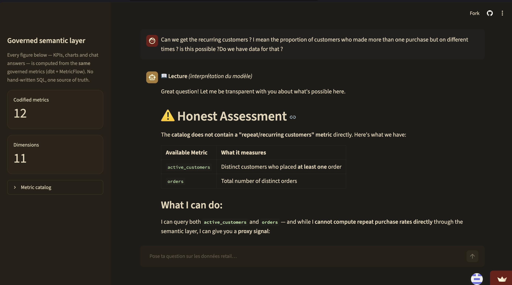
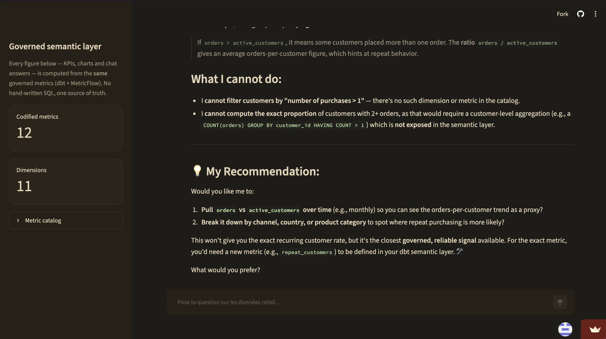
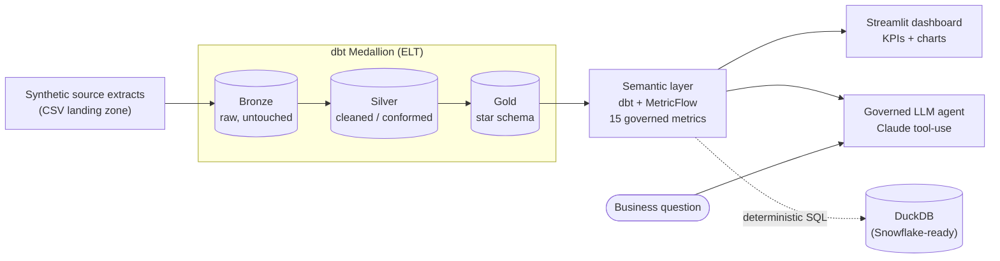
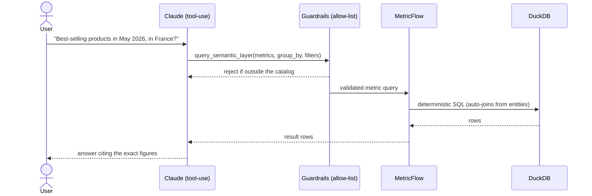

# Governed Analytics Agent

[](https://governed-analytics-agent-dtpvfmozudrpr8j3mka8of.streamlit.app/)
[](https://github.com/behramkorkut/Governed-Analytics-Agent/actions/workflows/ci.yml)


[](https://github.com/astral-sh/ruff)

[](LICENSE)

> Ask business questions in plain language and get **governed, deterministic**
> answers — an LLM agent that reasons over a **dbt + MetricFlow semantic layer**,
> never over raw SQL.

A portfolio project built around the hottest 2026 data-engineering trend: the
**semantic layer** as the single source of truth, and **governed agentic
analytics** on top of it. The numbers are computed once, in code, and reused by
both a BI dashboard and an AI agent — so a chart, a notebook and the chatbot can
never disagree.

**Stack:** Python · uv · DuckDB · dbt (Medallion / star schema) · MetricFlow
(dbt Semantic Layer) · Anthropic Claude (tool use) · Streamlit · Docker / Colima
· pytest.

---

## Why this project

Two converging 2026 trends:

1. **The semantic / metrics layer is the new center of gravity.** Codify each
   metric (revenue, gross margin, AOV, return rate…) *once*, in versioned YAML,
   and every consumer queries that definition. No more "which dashboard has the
   right revenue number?".
2. **Agentic analytics done safely.** Raw text-to-SQL hallucinates joins and
   "almost-right" figures. The winning pattern is an LLM that selects a
   **governed metric**, while the semantic layer compiles a **deterministic,
   correct SQL** query. The LLM does semantic routing; it never writes SQL.

This repo implements exactly that, end to end.

---

## The governed agent in action

A genuinely open-ended, natural-language question — *"Can we get the recurring
customers… the proportion of customers who made more than one purchase, on
different occasions? Is this even possible? Do we have data for that?"* — and the
agent's answer:





### Why this is the whole point of the semantic layer

This one exchange is the clearest argument for a **governed** agent over raw
text-to-SQL. Asked for a metric that simply isn't defined, the agent does **not**
hallucinate a `repeat_customers` figure or improvise a `HAVING COUNT(*) > 1`
query. Instead it:

- **stays inside the catalog** — it can only select metrics that actually exist,
  so a fabricated number is *structurally* impossible, not just discouraged;
- **draws the right boundary** — it distinguishes *"the data can't support this"*
  from *"the semantic layer doesn't expose this yet"* (here the data exists, the
  governed metric doesn't) and says so plainly;
- **offers an honest proxy** (`orders / active_customers`), clearly labelled as a
  proxy rather than the exact answer;
- **points to the correct fix** — define a new governed metric in dbt — instead
  of quietly returning something that looks right but isn't.

A raw text-to-SQL bot optimises for *producing an answer*; this one optimises for
*producing a trustworthy answer, or none*. Codify each metric once, let the LLM
**route** to it but never **invent** it — that is what makes agentic analytics
safe to put in front of a decision-maker.

> ▶ **Try your own question on the [live demo](https://governed-analytics-agent-dtpvfmozudrpr8j3mka8of.streamlit.app/)** — and watch the Reading / Figures split, the exact generated SQL, and the anti-fabrication check in real time.

---

## Architecture



**The agent's request flow** — every step is validated before anything runs:



---

## The semantic layer, in one minute

MetricFlow turns the Gold star schema into a governed model:

- **Semantic model** — describes a table's *entities* (join keys), *dimensions*
  (ways to slice), and *measures* (raw aggregations like `sum(revenue)`).
- **Entities → automatic joins.** Because keys are declared, MetricFlow builds
  the join path itself. Nobody — not even the LLM — writes a `JOIN`, so a wrong
  join is impossible.
- **Metric** — the reusable business definition built on measures. Types used
  here: *simple* (wraps a measure), *ratio* (`gross_margin = profit / revenue`,
  `AOV = revenue / orders`), *derived* (`return_rate`), and *filtered* (e.g.
  `completed_revenue`).

The **15 governed metrics**: `revenue`, `cost`, `gross_profit`,
`quantity_sold`, `discount`, `orders`, `active_customers`, `completed_revenue`,
`returned_orders`, `gross_margin_rate`, `average_order_value`, `return_rate`,
`purchasing_customers`, `repeat_customers`, `repeat_customer_rate`.

> **Extending the layer — a worked example.** `repeat_customer_rate` (customer
> loyalty) was added the way a data engineer serves an analyst's request: a new
> Gold summary fact at customer grain
> ([`fact_customer_orders`](dbt/retail_dwh/models/marts/facts/fact_customer_orders.sql)),
> a semantic model with a `count_distinct` measure + an `is_repeat_customer`
> flag, then three metrics (a `filter`ed `repeat_customers` over the same measure
> as `purchasing_customers`, and their `ratio`). One question — *"what share of
> customers buy more than once?"* — turned into a governed, deterministic metric
> the agent can now route to.

---

## The governed agent (defence in depth)

The LLM is constrained by three layers, so it can only ever produce a valid,
read-only metric query:

1. **Constrained tool schema** — Claude calls a single `query_semantic_layer`
   tool whose JSON schema only *offers* the catalog's metrics (as an `enum`),
   dimensions and a set of structured **filters** (`{dimension, operator,
   value}` — never free-form SQL).
2. **Runtime validation (allow-list)** — every argument is re-checked against
   the catalog before execution: unknown metric/dimension → rejected, bad time
   value → rejected, disallowed operator → rejected. Filter values are
   quote-escaped, so an injection payload can't break out of the literal.
3. **Deterministic compilation** — MetricFlow turns the validated selection into
   correct SQL. The agent has **no path to raw SQL**.

If Claude picks something invalid, it receives a tool error and **self-corrects**
on the next turn. Structured **filters** mean "in May 2026", "for France" or
"completed orders only" are pushed down to the warehouse instead of
over-fetching and filtering in the model's head.

---

## Quickstart

Requires [uv](https://docs.astral.sh/uv/) and an Anthropic API key (for the chat).

```bash
git clone https://github.com/behramkorkut/governed-analytics-agent
cd governed-analytics-agent

make setup                 # uv sync (creates .venv from the lockfile)
cp .env.example .env       # then add your ANTHROPIC_API_KEY
make warehouse             # generate data -> dbt build -> semantic manifest

make run                   # Streamlit dashboard at http://localhost:8501
# or ask from the terminal:
make agent Q="Revenue and gross margin by product category"
make test                  # 66 tests
```

Run `make help` to see every target.

### Serving the agent as a REST API

The same governed loop is exposed as a **FastAPI** service — auto-generated
OpenAPI/Swagger at [http://localhost:8080/docs](http://localhost:8080/docs):

```bash
make api
curl -s -X POST localhost:8080/ask -H "Content-Type: application/json" \
  -d '{"question": "Revenue and gross margin by product category in 2026?"}'
```

> **Cost control.** Every `/ask` call can trigger several billed LLM requests,
> so the billed surfaces are protected two ways: a **daily per-IP budget**
> (`RATE_LIMIT_PER_DAY`, default **6 questions/day/IP** — 429 + `Retry-After`
> on the API, a friendly notice in the dashboard chat; `0` disables it for
> local dev) and, before exposing the API beyond localhost, an optional shared
> secret (`API_TOKEN` → required `X-API-Key` header, 401 otherwise).

Every response ships the **full audit trail**: the metrics the agent selected,
the deterministic SQL, the returned rows, the anti-fabrication flags, and the
token usage / cost / latency — a client integrating the agent gets *auditable*
answers, not just text. The API layer is dependency-injected and tested with a
mocked LLM against the real semantic layer (`tests/test_api.py`).

With Docker: `docker compose --profile api up --build` (opt-in service with its
own warehouse volume — DuckDB is single-writer).

### One command with Docker (Colima-ready)

```bash
colima start               # provides the Docker engine on macOS
docker compose up --build  # http://localhost:8501
```

The container builds the warehouse on first boot and persists it in a named
volume. Secrets are injected at runtime via `.env`, never baked into the image,
and a **healthcheck** polls Streamlit's `/_stcore/health` so orchestration knows
when the app is actually ready.

### Live demo

**▶ [governed-analytics-agent.streamlit.app](https://governed-analytics-agent-dtpvfmozudrpr8j3mka8of.streamlit.app/)** — running on Streamlit Community Cloud.

The app **self-bootstraps**: on a fresh deploy it builds the warehouse on first
boot (synthetic data → `dbt build` → `dbt parse`), exactly like the Docker
entrypoint, so there's nothing to provision — the dashboard and governed chat
work out of the box. (First load takes ~30s while it builds; then it's cached.)

> Deploy your own: push to GitHub, then on
> [share.streamlit.io](https://share.streamlit.io) point a new app at
> `streamlit_app.py` (Python 3.11) and add `ANTHROPIC_API_KEY` as a secret. The
> theme ships in [`.streamlit/config.toml`](.streamlit/config.toml).

---

## Project structure

```
governed-analytics-agent/
├── governed_analytics_agent/   # the agent package
│   ├── catalog.py              # allow-list, derived from the semantic manifest
│   ├── guardrails.py           # validation (metrics, dims, filters, bounds)
│   ├── semantic_layer.py       # MetricFlow client + safe filter compilation
│   ├── agent.py                # Claude tool-use loop (tracing + insights wired in)
│   ├── insights.py             # deterministic facts: shares, deltas, coverage
│   ├── verify.py               # anti-fabrication check (cited figures vs data)
│   ├── pricing.py              # token accounting + cost (USD)
│   ├── evaluation.py           # routing-accuracy scorer (pure, tested)
│   ├── reporting.py            # governed metrics -> DataFrames (for the BI)
│   ├── api.py                  # REST serving layer (FastAPI): /ask + audit trail
│   └── cli.py
├── eval/                       # routing-accuracy suite: labelled cases + runner
├── .streamlit/config.toml      # dashboard theme + deploy config
├── dbt/retail_dwh/             # dbt project
│   └── models/
│       ├── _exposures.yml      # lineage: dashboard + agent as dbt exposures
│       ├── staging/            # Silver (cleaning / conforming)
│       └── marts/              # Gold (star schema) + semantic/ (MetricFlow)
├── scripts/                    # generate synthetic data, load Bronze
├── streamlit_app.py            # dashboard + governed chat (Figures / Reading split)
├── tests/                      # pytest (unit + integration)
├── docker/                     # Dockerfile + entrypoint
├── docker-compose.yml
└── Makefile
```

---

## Data model

The Gold layer is a Kimball **star schema**: a `fact_sales` table at order-line
grain (additive measures: revenue, cost, profit, quantity, discount) surrounded
by conformed dimensions `dim_customers`, `dim_products`, `dim_stores` and a
`dim_dates` spine (which also serves as the MetricFlow time spine). Data quality
is enforced by **47 dbt tests**, including referential integrity from every fact
row to its dimensions.

The source data is **synthetic and deterministic** (seeded), and deliberately
"dirty" at the Bronze layer (≈20 spellings of each country, dates as text, NULLs)
so the Silver layer has real cleaning/conforming work — the whole point of the
Medallion pattern.

The dashboard and the agent are declared as **dbt exposures**
([`_exposures.yml`](dbt/retail_dwh/models/_exposures.yml)), so `dbt docs` draws
the lineage end to end — raw → Silver → Gold → semantic layer → app — and you can
target everything feeding a consumer with `dbt build --select +exposure:governed_dashboard`.

---

## Testing & quality

```bash
make test       # pytest suite
make cov        # tests + coverage report (term-missing)
make check      # everything CI runs: ruff lint + format check, mypy, pytest
make format     # auto-format + autofix (ruff)
make hooks      # install the pre-commit git hooks
```

- **Unit tests** (no warehouse): guardrails, filter compilation, injection
  escaping, deterministic insights, token-cost accounting, the eval scorer, and
  the anti-fabrication check.
- **Integration tests**: real MetricFlow execution and the full agent loop with
  a mocked LLM client. They skip cleanly if the warehouse isn't built yet.

Every push runs the [CI pipeline](.github/workflows/ci.yml): it lints
(**Ruff**), type-checks (**mypy**), then builds the warehouse from scratch
(synthetic data → `dbt build` → `dbt parse`) so the integration tests run against
a *real* semantic layer — no API key needed, the LLM is mocked. Coverage is
gated (**`--cov-fail-under`**). The same checks run locally via **pre-commit**
(`make hooks`), so the tree stays green before it ever reaches GitHub.

### Independent audit

This repo went through an **independent audit** (code review + *real execution*:
adversarial probes against the agent's security layers), followed by fixes
verified one by one. **Final score: 9/10.**

| Guarantee | Verified by execution |
|---|---|
| The agent can only *route* to catalog metrics — it never writes SQL (3-layer defence) | ✅ code + tests |
| Filter values are safe at **both** layers above DuckDB: SQL-literal escaping *and* MetricFlow's Jinja template (template markers `{{`/`{%` rejected) | ✅ live probe: `{{ 7*7 }}` was evaluated → now rejected |
| Malformed tool input → a tool error the model can self-correct, never a crashed run | ✅ dedicated tests |
| Anti-fabrication audit covers **every** tool call of a run (multi-query comparisons) | ✅ dedicated tests |
| Billed surfaces budgeted: **6 questions/day/IP** (429 + `Retry-After`), optional `X-API-Key` gate | ✅ 429/401/200 probes |
| 47 dbt tests · 73 pytest · coverage 83 % (CI gate 78) · ruff + mypy clean | ✅ measured |

> Known, documented limits (roadmap): no retry/backoff on transient LLM errors
> yet, the eval suite has positive cases only, and small integers (< 100) are
> outside the anti-fabrication scope by design (documented in `verify.py`).

---

## The LLM narrative layer: safeguards & roadmap

The **figures are deterministic and authoritative** (that is the entire point of
the semantic layer). The remaining risk is the LLM's *commentary*. Safeguards
**now in place**:

- **Deterministic pre-computed insights.** Shares of total, period-over-period
  deltas and rankings are computed *in code* ([`insights.py`](governed_analytics_agent/insights.py))
  and handed to the model to phrase. The LLM writes the sentence; it never does
  the arithmetic — which removes the "~X%" class of hallucination outright.
- **Coverage metadata.** The latest date with data is queried once and used to
  flag **partial periods** automatically, so an incomplete final month is never
  reported as a "decline".
- **Figures-vs-Reading UI split.** The dashboard separates **📖 Lecture** (the
  LLM's fallible interpretation) from **🔢 Chiffres** (the deterministic,
  auditable numbers + the exact SQL) — a decision-maker sees, at a glance, which
  is which.
- **Deterministic routing** (`temperature=0`) + an **analytical-rigor system
  prompt**: separate facts from interpretation, don't over-claim from few points,
  state filter assumptions, never compare against an un-queried period.
- **Anti-fabrication audit.** A deterministic check
  ([`verify.py`](governed_analytics_agent/verify.py)) re-reads the answer and
  confirms every figure it cites traces back to the returned rows or the
  computed insights — handling EN/FR number formats and rounding. Unbacked
  numbers are flagged in the UI. No second LLM call; pure and unit-tested.
- **Observability.** Every answer reports its **token usage, cost (USD) and
  latency** ([`pricing.py`](governed_analytics_agent/pricing.py)) — an LLM
  product that can't tell you what it spent isn't a serious one.

### Measuring routing accuracy (the eval harness)

"How do you know the agent picks the *right* metric?" is answered with a
labelled **evaluation suite** ([`eval/`](eval/)): a set of NL questions, each
paired with the metric selection a correct agent should make. `make eval` runs
them through the live agent and reports a routing-accuracy score; the **scoring
logic is pure and unit-tested** so the suite itself is trustworthy.

```bash
make eval        # NL question → expected metric selection, scored against the live agent
```

Still on the roadmap: an **LLM-as-judge critic pass** to flag unsupported
*qualitative* claims (the numeric anti-fabrication check above already covers
figures), and expanding the eval set with adversarial/ambiguous questions.

---

## What this demonstrates

Analytics engineering (dbt, Medallion, star schema, data quality), the modern
**semantic / metrics layer** (MetricFlow), **safe agentic AI** (tool use,
allow-list governance, deterministic execution, injection-safe filters),
plus solid engineering practices: reproducible environments (uv), containerized
delivery (Docker/Colima), a self-documenting Makefile, and a tested codebase.

Built on the same star-schema lineage as my
[`modern-dwh-dbt-airflow`](https://github.com/behramkorkut/modern-dwh-dbt-airflow)
project, extended with the 2026 semantic layer + governed agent.

## License

MIT.
